# traccc

Demonstrator tracking chain for accelerators.

## Features

| Category           | Algorithms             | CPU | CUDA | SYCL | Alpaka | Kokkos | Futhark |
| ------------------ | ---------------------- | --- | ---- | ---- | ------ | ------ | ------- |
| **Clusterization** | CCL / FastSv / etc.    | ✅  | ✅   | ✅   | 🟡     | ⚪     | ✅      |
|                    | Measurement creation   | ✅  | ✅   | ✅   | 🟡     | ⚪     | ✅      |
| **Seeding**        | Spacepoint formation   | ✅  | ✅   | ✅   | 🟡     | ⚪     | ⚪      |
|                    | Spacepoint binning     | ✅  | ✅   | ✅   | ✅     | ✅     | ⚪      |
|                    | Seed finding           | ✅  | ✅   | ✅   | ✅     | ⚪     | ⚪      |
|                    | Track param estimation | ✅  | ✅   | ✅   | ✅     | ⚪     | ⚪      |
| **Track finding**  | Combinatorial KF       | ✅  | ✅   | ✅   | 🟡     | ⚪     | ⚪      |
| **Track fitting**  | KF                     | ✅  | ✅   | 🟡   | ⚪     | ⚪     | ⚪      |
| **Ambiguity resolution**  | Greedy resolver   | ✅  | ⚪   |  ⚪  | ⚪     | ⚪     | ⚪      |

✅: exists, 🟡: work started, ⚪: work not started yet

The relations between datatypes and algorithms is given in the (approximately
commutative) diagram shown below. Black lines indicate CPU algorithms, green
lines indicate CUDA algorithms, blue lines indicate SYCL algorithms, and brown
lines indicate Futhark algorithms. Solid algorithms are ready for use, dashed
algorithms are in development or future goals. Data types for different
heterogeneous platforms are contracted for legibility, and identities are
hidden.

```mermaid
flowchart LR
    subgraph clusterization [<a href='https://github.com/acts-project/traccc/blob/main/core/include/traccc/clusterization/'>Clusterization</a>]
        direction TB
        cell(Cells);
        cluster(Clusters);
        meas(Measurements);
    end

    subgraph trkfinding [<a href='https://github.com/acts-project/traccc/blob/main/core/include/traccc/finding/'>Track Finding</a>]
        sp(Spacepoints);
        bin(Spacepoint Grid);
        seed(Seeds);
        ptrack(Prototracks);
    end

    subgraph trkfitting [<a href='https://github.com/acts-project/traccc/blob/main/core/include/traccc/fitting/'>Track Fitting</a>]
        trackc(Track Candidates)
        tracks(Track States);
    end

    click cell href "https://github.com/acts-project/traccc/blob/main/core/include/traccc/edm/silicon_cell_collection.hpp";
    click cluster href "https://github.com/acts-project/traccc/blob/main/core/include/traccc/edm/silicon_cluster_collection.hpp";
    click meas href "https://github.com/acts-project/traccc/blob/main/core/include/traccc/edm/measurement.hpp";
    click sp href "https://github.com/acts-project/traccc/blob/main/core/include/traccc/edm/spacepoint.hpp";
    click bin href "https://github.com/acts-project/traccc/blob/main/core/include/traccc/seeding/detail/spacepoint_grid.hpp";
    click seed href "https://github.com/acts-project/traccc/blob/main/core/include/traccc/edm/seed.hpp";
    click ptrack href "https://github.com/acts-project/traccc/blob/main/core/include/traccc/edm/track_parameters.hpp";
    click trackc href "https://github.com/acts-project/traccc/blob/main/core/include/traccc/edm/track_candidate.hpp";
    click tracks href "https://github.com/acts-project/traccc/blob/main/core/include/traccc/edm/track_state.hpp";

    %% Host CCL algorithm
    cell -->|<a href='https://github.com/acts-project/traccc/blob/main/core/include/traccc/clusterization/sparse_ccl_algorithm.hpp'>Sparse CCL</a>| cluster;
    linkStyle 0 stroke: black;

    %% Host measurement creation
    cluster -->|<a href='https://github.com/acts-project/traccc/blob/main/core/include/traccc/clusterization/measurement_creation_algorithm.hpp'>Meas. Creat.</a>| meas;
    linkStyle 1 stroke: black;

    %% SYCL clusterization
    cell -->|<a href='https://github.com/acts-project/traccc/blob/main/device/sycl/include/traccc/sycl/clusterization/clusterization_algorithm.hpp'>Clustering</a>| meas;
    linkStyle 2 stroke: blue;

    %% CUDA clusterization
    cell -->|<a href='https://github.com/acts-project/traccc/blob/main/device/cuda/include/traccc/cuda/clusterization/clusterization_algorithm.hpp'>Clustering</a>| meas;
    linkStyle 3 stroke: green;

    %% Alpaka clusterization
    cell -->|<a href='https://github.com/acts-project/traccc/blob/main/device/alpaka/include/traccc/alpaka/clusterization/clusterization_algorithm.hpp'>Clustering</a>| meas;
    linkStyle 4 stroke: orange;

    %% Host spacepoint formation
    meas -->|<a href='https://github.com/acts-project/traccc/blob/main/core/include/traccc/seeding/silicon_pixel_spacepoint_formation_algorithm.hpp'>SP Form.</a>| sp;
    linkStyle 5 stroke: black;

    %% SYCL spacepoint formation
    meas -->|<a href='https://github.com/acts-project/traccc/blob/main/device/sycl/include/traccc/sycl/seeding/silicon_pixel_spacepoint_formation_algorithm.hpp'>SP Form.</a>| sp;
    linkStyle 6 stroke: blue;

    %% CUDA spacepoint formation
    meas -->|<a href='https://github.com/acts-project/traccc/blob/main/device/cuda/include/traccc/cuda/seeding/spacepoint_formation_algorithm.hpp'>SP Form.</a>| sp;
    linkStyle 7 stroke: green;

    %% Alpaka spacepoint formation
    meas -->|<a href='https://github.com/acts-project/traccc/blob/main/device/alpaka/include/traccc/alpaka/seeding/spacepoint_formation_algorithm.hpp'>SP Form.</a>| sp;
    linkStyle 8 stroke: orange;

    %% Host spacepoint binning
    sp -->|<a href='https://github.com/acts-project/traccc/blob/main/core/include/traccc/seeding/spacepoint_binning.hpp'>SP Binning</a>| bin;
    linkStyle 9 stroke: black;

    %% SYCL spacepoint binning
    sp -->|<a href='https://github.com/acts-project/traccc/blob/main/device/sycl/include/traccc/sycl/seeding/spacepoint_binning.hpp'>SP Binning</a>| bin;
    linkStyle 10 stroke: blue;

    %% CUDA spacepoint binning
    sp -->|<a href='https://github.com/acts-project/traccc/blob/main/device/cuda/include/traccc/cuda/seeding/spacepoint_binning.hpp'>SP Binning</a>| bin;
    linkStyle 11 stroke: green;

    %% Alpaka spacepoint binning
    sp -->|<a href='https://github.com/acts-project/traccc/blob/main/device/alpaka/include/traccc/alpaka/seeding/spacepoint_binning.hpp'>SP Binning</a>| bin;
    linkStyle 12 stroke: orange;

    %% Host seeding
    bin -->|<a href='https://github.com/acts-project/traccc/blob/main/core/include/traccc/seeding/seed_finding.hpp'>Seeding</a>| seed;
    linkStyle 13 stroke: black;

    %% SYCL seeding
    bin -->|<a href='https://github.com/acts-project/traccc/blob/main/device/sycl/include/traccc/sycl/seeding/seed_finding.hpp'>Seeding</a>| seed;
    linkStyle 14 stroke: blue;

    %% CUDA seeding
    bin -->|<a href='https://github.com/acts-project/traccc/blob/main/device/cuda/include/traccc/cuda/seeding/seed_finding.hpp'>Seeding</a>| seed;
    linkStyle 15 stroke: green;

    %% Alpaka seeding
    bin -->|<a href='https://github.com/acts-project/traccc/blob/main/device/alpaka/include/traccc/alpaka/seeding/seed_finding.hpp'>Seeding</a>| seed;
    linkStyle 16 stroke: orange;

    %% Host param est.
    seed -->|<a href='https://github.com/acts-project/traccc/blob/main/core/include/traccc/seeding/track_params_estimation.hpp'>Param. Est.</a>| ptrack;
    linkStyle 17 stroke: black;

    %% SYCL param est.
    seed -->|<a href='https://github.com/acts-project/traccc/blob/main/device/sycl/include/traccc/sycl/seeding/track_params_estimation.hpp'>Param. Est.</a>| ptrack;
    linkStyle 18 stroke: blue;

    %% CUDA param est.
    seed -->|<a href='https://github.com/acts-project/traccc/blob/main/device/cuda/include/traccc/cuda/seeding/track_params_estimation.hpp'>Param. Est.</a>| ptrack;
    linkStyle 19 stroke: green;

    %% Alpaka param est.
    seed -->|<a href='https://github.com/acts-project/traccc/blob/main/device/alpaka/include/traccc/alpaka/seeding/track_params_estimation.hpp'>Param. Est.</a>| ptrack;
    linkStyle 20 stroke: orange;

    %% Host CKF
    ptrack -->|<a href='https://github.com/acts-project/traccc/blob/main/core/include/traccc/finding/combinatorial_kalman_filter_algorithm.hpp'>CKF</a>| trackc;
    linkStyle 21 stroke: black;

    %% Host Kalman filter
    trackc -->|<a href='https://github.com/acts-project/traccc/blob/main/core/include/traccc/fitting/kalman_fitting_algorithm.hpp'>Kalman filter</a>| tracks;
    linkStyle 22 stroke: black;

    %% SYCL CKF
    ptrack -->|<a href='https://github.com/acts-project/traccc/blob/main/device/sycl/include/traccc/sycl/finding/combinatorial_kalman_filter_algorithm.hpp'>CKF</a>| trackc;
    linkStyle 23 stroke: blue;

    %% SYCL Kalman filter
    trackc -->|<a href='https://github.com/acts-project/traccc/blob/main/device/sycl/include/traccc/sycl/fitting/kalman_fitting_algorithm.hpp'>Kalman filter</a>| tracks;
    linkStyle 24 stroke: blue;

    %% CUDA CKF
    ptrack -->|<a href='https://github.com/acts-project/traccc/blob/main/device/cuda/include/traccc/cuda/finding/finding_algorithm.hpp'>CKF</a>| trackc;
    linkStyle 25 stroke: green;

    %% CUDA Kalman filter
    trackc -->|<a href='https://github.com/acts-project/traccc/blob/main/device/cuda/include/traccc/cuda/fitting/fitting_algorithm.hpp'>Kalman filter</a>| tracks;
    linkStyle 26 stroke: green;
```



## Requirements and dependencies

### OS & compilers:

Please note that due to the complexity of this software and its build system,
it may be somewhat fragile in the face of compiler version changes. The
following are general guidelines for getting _traccc_ to compile:

- The C++ compiler must support C++20

In addition, the following requirements hold when CUDA is enabled:

- The CUDA Toolkit version must be greater than major version 12
- Ensure that the CUDA host compiler supports C++20 and is compatible with the
  `nvcc` compiler driver

The following table lists currently combinations of builds, compilers,
and toolchains that are currently known to work (last updated 2022/01/24):

| Build | OS | gcc | CUDA | comment |
| --- | --- | --- | --- | --- |
| CUDA | Ubuntu 24.04   | 13.3.0 | 12.6 | runs on CI |

### Dependencies

- [Boost](https://www.boost.org/): program_options
- [CMake](https://cmake.org/)
- (Optional) [ROOT](https://root.cern/): RIO, Hist, Tree

### Dependency management with Spack

The [Spack](https://spack.io/) project provides a particularly easy way to
install the dependencies that you need to use traccc. In order to use Spack to
manage your dependencies, simply create a new Spack environment using the
provided environment file:

```sh
spack env create traccc spack.yaml
spack -e traccc concretize -f
spack -e traccc install
spack env activate traccc
```

This way, Spack will automatically download and install all dependencies
necessary to use traccc with the CUDA, SYCL, Kokkos, and Alpaka programming
models. When using Spack to manage your dependencies, make sure to compile
traccc with the `-DTRACCC_USE_SPACK_LIBS=ON` flag.

## Getting started

### Clone the repository

Clone the repository and setup the data directory.

```sh
git clone https://github.com/acts-project/traccc.git
./traccc/data/traccc_data_get_files.sh
```

### Build the project

```sh
cmake --preset <preset> [options] -S traccc/ -B build
cmake --build build/
```

### Build presets

| Name | Description |
| --- | --- |
| host-fp32 | FP32 build of the host code with ROOT enabled |
| host-fp64 | FP64 build of the host code with ROOT enabled |
| cuda-fp32 | FP32 build of the CUDA code |
| cuda-fp64 | FP64 build of the CUDA code |
| sycl-fp32 | FP32 build of the SYCL code |
| sycl-fp64 | FP64 build of the SYCL code |
| alpaka-fp32 | FP32 build of the Alpaka code |
| alpaka-fp64 | FP64 build of the Alpaka code |

### Detailed build options

| Option | Description |
| --- | --- |
| TRACCC_BUILD_CUDA  | Build the CUDA sources included in traccc |
| TRACCC_BUILD_SYCL  | Build the SYCL sources included in traccc |
| TRACCC_BUILD_ALPAKA | Build the Alpaka sources included in traccc |
| TRACCC_BUILD_TESTING  | Build the (unit) tests of traccc |
| TRACCC_BUILD_EXAMPLES  | Build the examples of traccc |
| TRACCC_USE_SYSTEM_VECMEM | Pick up an existing installation of VecMem from the build environment |
| TRACCC_USE_SYSTEM_EIGEN3 | Pick up an existing installation of Eigen3 from the build environment |
| TRACCC_USE_SYSTEM_ALGEBRA_PLUGINS | Pick up an existing installation of Algebra Plugins from the build environment |
| TRACCC_USE_SYSTEM_DFELIBS | Pick up an existing installation of dfelibs from the build environment |
| TRACCC_USE_SYSTEM_DETRAY | Pick up an existing installation of Detray from the build environment |
| TRACCC_USE_SYSTEM_ACTS | Pick up an existing installation of Acts from the build environment |
| TRACCC_USE_SYSTEM_GOOGLETEST | Pick up an existing installation of GoogleTest from the build environment |
| TRACCC_USE_ROOT | Build physics performance analysis code using an existing installation of ROOT from the build environment |

## Examples

### Full reconstruction chain

```console
<build_directory>/bin/traccc_seq_example \
   --detector-file=geometries/odd/odd-detray_geometry_detray.json \
   --material-file=geometries/odd/odd-detray_material_detray.json \
   --grid-file=geometries/odd/odd-detray_surface_grids_detray.json \
   --use-detray-detector \
   --digitization-file=geometries/odd/odd-digi-geometric-config.json \
   --use-acts-geom-source --input-directory=odd/geant4_10muon_10GeV/ \
   --input-events=10

<build_directory>/bin/traccc_throughput_mt \
   --detector-file=geometries/odd/odd-detray_geometry_detray.json \
   --material-file=geometries/odd/odd-detray_material_detray.json \
   --grid-file=geometries/odd/odd-detray_surface_grids_detray.json \
   --use-detray-detector \
   --digitization-file=geometries/odd/odd-digi-geometric-config.json \
   --use-acts-geom-source --input-directory=odd/geant4_10muon_10GeV/ \
   --input-events=10 --processed-events=1000 --threads=1
```

Depending on the build options, can also use variants of the executables
postfixed by `_cuda`, `_sycl` and `_alpaka`, with the same options.

### Running a partial chain with simplified simulation data

Users can generate muon-like particle simulation data with the pre-built detray geometries:

```sh
# Generate telescope geometry data
<build_directory>/bin/traccc_simulate_telescope --gen-vertex-xyz-mm=0:0:0 --gen-vertex-xyz-std-mm=0:0:0 --gen-mom-gev=100:100 --gen-phi-degree=0:0 --gen-events=10 --gen-nparticles=2000 --output-directory=detray_simulation/telescope_detector/n_particles_2000/ --gen-eta=1:3

# Generate toy geometry data
<build_directory>/bin/traccc_simulate_toy_detector --gen-vertex-xyz-mm=0:0:0 --gen-vertex-xyz-std-mm=0:0:0 --gen-mom-gev=100:100 --gen-phi-degree=0:360 --gen-events=10 --gen-nparticles=2000 --output-directory=detray_simulation/toy_detector/n_particles_2000/ --gen-eta=-3:3 --constraint-step-size-mm=1 --search-window 3:3

# Generate drift chamber data
<build_directory>/bin/traccc_simulate_wire_chamber --gen-vertex-xyz-mm=0:0:0 --gen-vertex-xyz-std-mm=0:0:0 --gen-mom-gev=2:2 --gen-phi-degree=0:360 --gen-events=10 --gen-nparticles=100 --output-directory=detray_simulation/wire_chamber/n_particles_100/ --gen-eta=-1:1 --constraint-step-size-mm=1 --search-window 3:3
```

The simulation will also generate the detector json files (geometry, material and surface_grid) in the current directory. It is user's responsibility to move them to an appropriate place (e.g. `<detector_directory>`) and match them to the input file arguments of reconstruction chains.

If users have a geometry json file already, it is also possible to run simulation with `traccc_simulate` application

```sh
# Given that users have a geometry json file
<build_directory>/bin/traccc_simulate  --output-directory=<output-directory>  --detector-file=<geometry_file> --material-file=<material-file> --grid-file=<grid-file>  --event=10 --constraint-step-size-mm=1
```

There are three types of partial reconstruction chain users can operate: `seeding_example`, `truth_finding_example`, and `truth_fitting_example` where their algorithm coverages are shown in the table below. Each of them starts from truth measurements, truth seeds, and truth tracks, respectively.

| Category                | Clusterization | Seeding | Track finding | Track fitting |
| ----------------------- | -------------- | ------- | ------------- | ------------- |
| `seeding_example`       |                | ✅      | ✅            | ✅            |
| `truth_finding_example` |                |         | ✅            | ✅            |
| `truth_fitting_example` |                |         |               | ✅            |

The dirft chamber will not produce meaningful results with `seeding_example` as the current seeding algorithm is only designed for 2D measurement objects. Truth finding works OK in general but the combinatoric explosion can occur for a few unlucky events, leading to poor pull value distributions. The followings are example commands:

```sh
# Run cuda seeding example for toy geometry
<build_directory>/bin/traccc_seeding_example_cuda --input-directory=detray_simulation/toy_detector/n_particles_2000/ --check-performance --detector-file=<detector_directory>/toy_detector_geometry.json --material-file=<detector_directory>/toy_detector_homogeneous_material.json --grid-file=<detector_directory>/toy_detector_surface_grids.json --input-events=1 --track-candidates-range=3:30 --constraint-step-size-mm=1000 --run-cpu=1 --search-window 3:3
```

```sh
# Run cuda truth finding example for toy geometry
<build_directory>/bin/traccc_truth_finding_example_cuda --input-directory=detray_simulation/toy_detector/n_particles_2000/ --check-performance --detector-file=<detector_directory>/toy_detector_geometry.json --material-file=<detector_directory>/toy_detector_homogeneous_material.json --grid-file=<detector_directory>/toy_detector_surface_grids.json --input-events=1 --track-candidates-range=3:30 --constraint-step-size-mm=1000 --run-cpu=1 --search-window 3:3
```

```sh
# Run cuda truth finding example for drift chamber
<build_directory>/bin/traccc_truth_finding_example_cuda --input-directory=detray_simulation/wire_chamber/n_particles_100/ --check-performance --detector-file=<detector_directory>/wire_chamber_geometry.json --material-file=<detector_directory>/wire_chamber_homogeneous_material.json --grid-file=<detector_directory>/wire_chamber_surface_grids.json  --input-events=10 --track-candidates-range=6:30 --constraint-step-size-mm=1 --run-cpu=1 --search-window 3:3
```

```sh
# Run cpu truth fitting example for drift chamber
<build_directory>/bin/traccc_truth_fitting_example --input-directory=detray_simulation/wire_chamber/n_particles_2000_100GeV/ --check-performance --detector-file=<detector_directory>/wire_chamber_geometry.json --material-file=<detector_directory>/wire_chamber_homogeneous_material.json --grid-file=<detector_directory>/wire_chamber_surface_grids.json --input-events=10 --constraint-step-size-mm=1 --search-window 3:3
```

Users can open the performance root files (with `--check-performance=true`) and draw the histograms.

```sh
$ root -l performance_track_finding.root
root [0]
Attaching file performance_track_finding.root as _file0...
(TFile *) 0x3871910
root [1] finding_trackeff_vs_eta->Draw()
```

## Contributing

### Code formatting

The traccc code is formatted using clang-format; the recommended way to ensure that your code is properly formatted is to use [pre-commit](https://pre-commit.com/). The pre-commit webpage has a useful guide for using the tool, but the simplest way of using it (without installing it as a pre-commit hook) is as follows. First, install the tool with your favourite Python package manager:

```console
# With pip
$ pip install pre-commit
# With pipx
$ pip install pre-commit
```

The install step needs to be executed only once. After that, the code can be easily formatted as follows:

```console
$ pre-commit run --all-files
```

## Continuous benchmark

Monitoring the event throughput of track reconstruction with the toy geometry

- Number of events: 100
- Number of tracks per event: 5000
- Algorithms used: seeding, track finding and track fitting


## Troubleshooting

The following are potentially useful instructions for troubleshooting various
problems with your build:

### CUDA

#### Incompatible host compiler

You may experience errors being issued about standard library features, for example:

```
/usr/include/c++/11/bits/std_function.h:435:145: note:         ‘_ArgTypes’
/usr/include/c++/11/bits/std_function.h:530:146: error: parameter packs not expanded with ‘...’:
  530 |         operator=(_Functor&& __f)
```

In this case, your `nvcc` host compiler is most likely incompatible with your
CUDA toolkit. Consider installing a supported version and selecting it through
the `CUDAHOSTCXX` environment variable at build-time.
