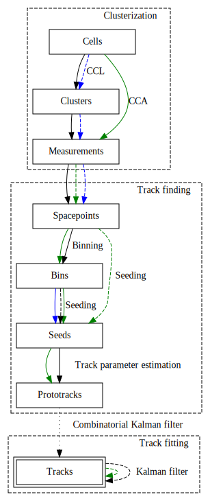

# traccc

Demonstrator tracking chain for accelerators.

## Features



| Category           | Algorithms             | CPU | CUDA | SYCL |
| ------------------ | ---------------------- | --- | ---- | ---- |
| **Clusterization** | CCL                    | ✅  | 🟡   | 🟡   |
|                    | Measurement creation   | ✅  | 🟡   | 🟡   |
|                    | Spacepoint formation   | ✅  | 🟡   | 🟡   |
| **Track finding**  | Spacepoint binning     | ✅  | ✅   | ⚪   |
|                    | Seed finding           | ✅  | ✅   | 🟡   |
|                    | Track param estimation | ✅  | ✅   | ⚪   |
|                    | Combinatorial KF       | ⚪  | ⚪   | ⚪   |
| **Track fitting**  | KF                     | 🟡  | 🟡   | ⚪   |

✅: exists, 🟡: work started, ⚪: work not started yet

In addition, the relations between datatypes and algorithms is given in the
(approximately commutative) diagram shown on the right. Black lines indicate
CPU algorithms, green lines indicate CUDA algorithms, and blue lines indicate
SYCL algorithms. Solid algorithms are ready for use, dashed algorithms are in
development, and dotted algorithms are future goals. Data types for different
heterogeneous platforms are contracted for legibility, and identities are
hidden.

## Requirements and dependencies 

### OS & compilers:

Please note that due to the complexity of this software and its build system,
it may be somewhat fragile in the face of compiler version changes. The
following are general guidelines for getting _traccc_ to compile:

- The C++ compiler must support C++17

In addition, the following requirements hold when CUDA is enabled:

- The CUDA Toolkit version must be greater than major version 11
- The CUDA Toolkit must not be minor version 11.3 due to a
  [bug](https://github.com/acts-project/traccc/issues/115) in the front-end
  compiler of that version
- Ensure that the CUDA host compiler supports C++17 and is compatible with the
  `nvcc` compiler driver

The following table lists currently combinations of builds, compilers,
and toolchains that are currently known to work (last updated 2022/01/24):

| Build | OS | gcc | cuda | comment |
| --- | --- | --- | --- | --- |
| CUDA | Ubuntu 20.04   | 9.3.0 | 11.5 | runs on CI |

### Data directory

The `data` directory is a submodule hosted as `git lfs` on `https://gitlab.cern.ch/acts/traccc-data`

## Getting started

### Clone the repository

Clone the repository and setup up the submodules, this requires `git-lfs` for the data from the `traccc-data` repository.

```sh
git clone git@github.com:acts-project/traccc.git
cd traccc
git submodule update --init
```

### Build the project

```sh
cmake -S . -B <build_directory>
cmake --build <build_directory> <options>
```

### Build options

| Option | Description | 
| --- | --- |
| TRACCC_BUILD_CUDA  | Build the CUDA sources included in traccc |
| TRACCC_BUILD_SYCL  | Build the SYCL sources included in traccc |
| TRACCC_BUILD_TESTING  | Build the (unit) tests of traccc |
| TRACCC_USE_SYSTEM_VECMEM | Pick up an existing installation of VecMem from the build environment |
| TRACCC_USE_SYSTEM_EIGEN3 | Pick up an existing installation of Eigen3 from the build environment |
| TRACCC_USE_SYSTEM_ALGEBRA_PLUGINS | Pick up an existing installation of Algebra Plugins from the build environment |
| TRACCC_USE_SYSTEM_DFELIBS | Pick up an existing installation of dfelibs from the build environment |
| TRACCC_USE_SYSTEM_DETRAY | Pick up an existing installation of Detray from the build environment |
| TRACCC_USE_SYSTEM_ACTS | Pick up an existing installation of Acts from the build environment |
| TRACCC_USE_SYSTEM_GOOGLETEST | Pick up an existing installation of GoogleTest from the build environment |

## Examples

### cpu reconstruction chain

```sh
<build_directory>/bin/seq_example tml_detector/trackml-detector.csv tml_pixels/ <number of events> 
```

### cuda reconstruction chain

- Users can generate cuda examples by adding `-DTRACCC_BUILD_CUDA=ON` to cmake options

```sh
<build_directory>/bin/seq_example_cuda tml_detector/trackml-detector.csv tml_pixels/ <number of events> <run cpu tracking>
```

## Troubleshooting

The following are potentially useful instructions for troubleshooting various
problems with your build:

### CUDA

#### Incompatible host compiler

You may experience errors being issued about standard library features, for example:

```
/usr/include/c++/11/bits/std_function.h:435:145: note:         ‘_ArgTypes’
/usr/include/c++/11/bits/std_function.h:530:146: error: parameter packs not expanded with ‘...’:
  530 |         operator=(_Functor&& __f)
```

In this case, your `nvcc` host compiler is most likely incompatible with your
CUDA toolkit. Consider installing a supported version and selecting it through
the `CUDAHOSTCXX` environment variable at build-time.
