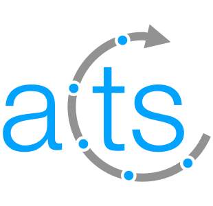

# covfie

[](https://github.com/acts-project/covfie/actions/workflows/builds.yml)
[](https://github.com/acts-project/covfie/actions/workflows/checks.yml)
[](https://covfie.readthedocs.io/en/latest/?badge=latest)
[](https://www.mozilla.org/en-US/MPL/2.0/)
[](https://github.com/acts-project/covfie/issues)
[](https://github.com/acts-project/covfie/pulls)
[](https://github.com/acts-project/covfie/commits/main)
[](https://github.com/acts-project/covfie/graphs/contributors)
[](https://github.com/acts-project/covfie/commits/main)

[](https://home.web.cern.ch/)
&nbsp;&nbsp;&nbsp;&nbsp;&nbsp;
[](https://www.uva.nl/)
&nbsp;&nbsp;&nbsp;&nbsp;&nbsp;
[](https://pcs-research.nl/)
&nbsp;
[](https://acts.readthedocs.io/en/latest/)

**covfie** (pronounced _coffee_) is a **co**-processor **v**ector **fie**ld
library. covfie consists of two main components; the first is the header-only
C++ library, which can be used by scientific applications using CUDA or other
programming platforms. The second is a set of benchmarks which can be used to
quantify the computational performance of all the different vector field
implementations covfie provides. Arguably, the test suite constitutes a third
component.

## Quick start

All covfie vector fields are stored in the `covfie::field` type and they are
accessed using the `covfie::field_view` type. These require a backend type
passed as a template parameters, and their behaviour can be expanded using
transformers. The easiest way to get started using covfie is to use a field
builder backend, which allows you to write data to memory (the following
example is included in the repository as
[`readme_example_1`](examples/core/readme_example_1.cpp)):

```cpp
using field_t = covfie::field<covfie::backend::strided<
    covfie::vector::size2,
    covfie::backend::array<covfie::vector::float2>>>;

int main(void)
{
    // Initialize the field as a 10x10 field, then create a view from it.
    field_t my_field(covfie::make_parameter_pack(
        field_t::backend_t::configuration_t{10ul, 10ul}
    ));
    field_t::view_t my_view(my_field);

    // Assign f(x, y) = (sin x, cos y)
    for (std::size_t x = 0ul; x < 10ul; ++x) {
        for (std::size_t y = 0ul; y < 10ul; ++y) {
            my_view.at(x, y)[0] = std::sin(static_cast<float>(x));
            my_view.at(x, y)[1] = std::cos(static_cast<float>(y));
        }
    }

    // Retrieve the vector value at (2, 3)
    field_t::output_t v = my_view.at(2ul, 3ul);

    std::cout << "Value at (2, 3) = (" << v[0] << ", " << v[1] << ")"
              << std::endl;

    return 0;
}
```

This next example ([`readme_example_2`](examples/core/readme_example_2.cpp))
creates a two-dimensional vector field over the natural numbers, stretching 10
indices in each direction. If we want to use real numbers for our vector field,
we can simply add a linear interpolator:

```cpp
using builder_t = covfie::field<covfie::backend::strided<
    covfie::vector::size2,
    covfie::backend::array<covfie::vector::float2>>>;

using field_t = covfie::field<covfie::backend::linear<covfie::backend::strided<
    covfie::vector::size2,
    covfie::backend::array<covfie::vector::float2>>>>;

int main(void)
{
    // Initialize the field as a 10x10 field, then create a view from it.
    builder_t my_field(covfie::make_parameter_pack(
        builder_t::backend_t::configuration_t{10ul, 10ul}
    ));
    builder_t::view_t my_view(my_field);

    // Assign f(x, y) = (sin x, cos y)
    for (std::size_t x = 0ul; x < 10ul; ++x) {
        for (std::size_t y = 0ul; y < 10ul; ++y) {
            my_view.at(x, y)[0] = std::sin(static_cast<float>(x));
            my_view.at(x, y)[1] = std::cos(static_cast<float>(y));
        }
    }

    field_t new_field(my_field);
    field_t::view_t new_view(new_field);

    // Retrieve the vector value at (2.31, 3.98)
    field_t::output_t v = new_view.at(2.31f, 3.98f);

    std::cout << "Value at (2.31, 3.98) = (" << v[0] << ", " << v[1] << ")"
              << std::endl;

    return 0;
}
```

covfie types can seem intimidating at first, but they are quite friendly! Also,
you only really need to worry about them once, and you can hide them away in a
typedef.

## Citation

If you use covfie in your research, please cite the following paper:

```bibtex
@inproceedings{covfie_paper,
    author = {Swatman, Stephen Nicholas and Varbanescu, Ana-Lucia and Pimentel, Andy and Salzburger, Andreas and Krasznahorkay, Attila},
    title = {Systematically Exploring High-Performance Representations of Vector Fields Through Compile-Time Composition},
    year = {2023},
    isbn = {9798400700682},
    publisher = {Association for Computing Machinery},
    address = {New York, NY, USA},
    doi = {10.1145/3578244.3583723},
    booktitle = {Proceedings of the 2023 ACM/SPEC International Conference on Performance Engineering},
    pages = {55–66},
    numpages = {12},
    location = {Coimbra, Portugal},
    series = {ICPE '23}
}
```

You may also want to cite the software itself. Unfortunately, academia has not
yet progressed to the point where software citations are regarded as highly as
paper citations; therefore, we prefer references to the paper (although you may
want to cite both). To cite the software, use:

```bibtex
@software{covfie_lib,
    author = {Swatman, Stephen Nicholas},
    license = {MPL-2.0},
    title = {{Covfie: A Compositional Vector Field Library}},
    url = {https://github.com/acts-project/covfie}
}
```

## Documentation

All documentation pertaining to covfie can be found on ReadTheDocs at the
following URL: https://covfie.readthedocs.io/en/latest/

## Use cases

### Converting the ATLAS magnetic field

Given the [ATLAS magnetic field
file](https://gitlab.cern.ch/acts/acts-data/-/tree/master/MagneticField/ATLAS)
in text format, it can be converted into a covfie format using the
`convert_bfield` example (this requires `COVFIE_BUILD_EXAMPLES` to be enabled
at configuration time):

```bash
build/examples/core/convert_bfield --input ATLASBField_xyz.txt --output atlas_bfield.cvf
```
