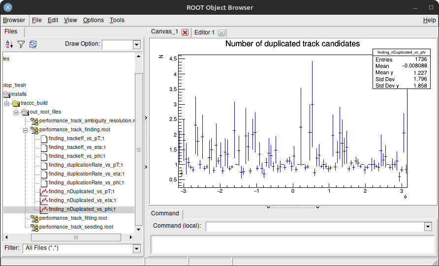
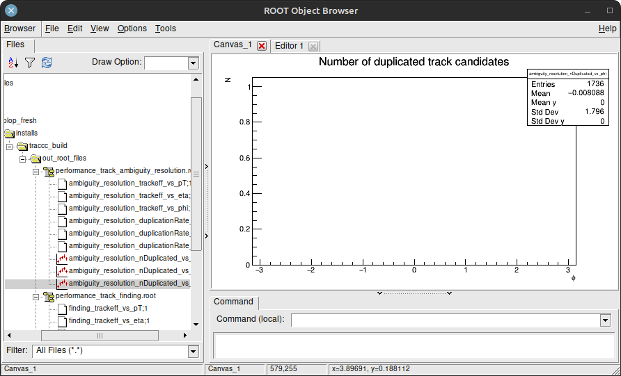

# Specific documentation on how to build and use ROOT for traccc

## Introduction

`traccc` generates data than can be visualized by `ROOT`, in order to evaluate the performance of some algorithms. Let's recap the full compilation and execution of `traccc`, since the initial clone, starting with the installation of ROOT.

To use `ROOT` in `traccc`, you need a working installation of `ROOT` compiled with the `C++17` standard. The [last precompiled version of root](https://root.cern/install/) may not be compiled with the `C++17` standard, so it may be necessary to [build ROOT from source as described on the official website](https://root.cern/install/build_from_source/). For example, you can add the following flags to your cmake configuration: `-DCMAKE_CXX_STANDARD=17 -DCXX_STANDARD_STRING="17" -DCMAKE_CXX_COMPILER=clang++-16 -DCMAKE_C_COMPILER=clang-16 `.

Compiling ROOT and traccc with the same compiler (e.g. clang++) can avoid link editing errors when compiling traccc.

<br>

Once `ROOT` and `traccc` are built, don't forget to source the `ROOT` script once before running traccc: `source "<path to root_build>/bin/thisroot.sh"`.

<br>

## Geometry data generation, with the toy detector 

```sh
export traccc_data_directory="${traccc_source_folder}/data" \
&& export traccc_geometry_folder_name="generated_toy_geometry" \
&& export traccc_geometry_directory="${traccc_data_directory}/${traccc_geometry_folder_name}"

# Remove previous generated files, if any
rm -fr $traccc_geometry_directory \
&& mkdir $traccc_geometry_directory \
&& cd $traccc_geometry_directory

# Generate muon-like particle data with the pre-built detray geometry (toy geometry data):
${traccc_build_folder}/bin/traccc_simulate_toy_detector --gen-vertex-xyz-mm=0:0:0 --gen-vertex-xyz-std-mm=0:0:0 --gen-mom-gev=100:100 --gen-phi-degree=0:360 --events=10 --gen-nparticles=2000 --output-directory=detray_simulation/toy_detector/n_particles_2000/ --gen-eta=-3:3 --constraint-step-size-mm=1
```

<br>

## Generation of the ROOT performance files, by executing the traccc full-chain `traccc_seeding_example`

```sh
export traccc_out_root_files_directory="${traccc_build_folder}/out_root_files"

rm -fr $traccc_out_root_files_directory \
&& mkdir $traccc_out_root_files_directory \
&& cd $traccc_out_root_files_directory

${traccc_build_folder}/bin/traccc_seeding_example --input-directory=detray_simulation/toy_detector/n_particles_2000/ --check-performance --detector-file=$traccc_geometry_folder_name/toy_detector_geometry.json --material-file=$traccc_geometry_folder_name/toy_detector_homogeneous_material.json --grid-file=$traccc_geometry_folder_name/toy_detector_surface_grids.json --event=1 --track-candidates-range=3:30 --constraint-step-size-mm=1000
```

<br>

## ROOT performance files visualization

You can either browse a directory containing the `ROOT` files and display each plot, or display a plot in particular.

Your `root` executable may be called `root.exe`. If so, use `root.exe` instead of `root`.

`end of file` terminates the `ROOT` prompt, so you may use `Ctrl + D` as a shortcut to exit `ROOT`. 

```sh
cd $traccc_out_root_files_directory

# Start the root command-line interface
root

# If you prefer not to use your web browser, you can disable its usage with the "--web" flag:
root --web=off

# You should see the prompt "root [0]".
# To browse a directory containing ROOT files, create a TBrowser:
root [0] new TBrowser
```

The native `TBwoser` should look like this. You can open `.root` files and display the graphics they contain.


<br>

## ROOT performance files interpretation

The `Number of duplicated track candidates` plots represents the number of `track duplicates` as a function of a given variable (example: `phi`). It varies between zero (no shared hits between tracks) and the number of `duplicated tracks` for a given value (example: of `phi`).



There are often many duplicated tracks at the end of the finding algorithm. The last algorithm in the chain is an ambiguity solver which attempts to decrease the number of duplicates while keeping as much valid tracks as possible. Here the `greedy solver` removed all the duplicates. It is an implementation of the greedy ambiguity resolution algorithm from ACTS adapted to `traccc`.



The `Tracking Efficiency` plots represents the number of `tracks matching the trajectory of a truth particle`, as a function of a given variable. It ranges from zero (no valid track found for a given value) to one (all the tracks were found for a given value).


The `greedy solver` performed very well in this case, since the truth particles were generated as high energy muons, mostly going through a straight line. We used `--gen-mom-gev=100:100` when running the traccc_simulate_toy_detector, generating high energy muons (100 GeV).


<br>

## Alternative visualization

You can display plots directly without creating a `TBrowser` by loading a file with `ROOT` and calling the `Draw()` method on the plot you whish to display. Here is an example displaying the previous plots:

```c++
// In a new ROOT prompt, load the .root file
root -l performance_track_finding.root

// Track finding efficiency
finding_trackeff_vs_phi->Draw()

// Track finding duplication rate
finding_nDuplicated_vs_phi->Draw()

// In a new ROOT prompt, load the .root file
root -l performance_track_ambiguity_resolution.root

// Ambiguity resolution efficiency
ambiguity_resolution_trackeff_vs_phi->Draw()

// Ambiguity resolution duplication rate
ambiguity_resolution_nDuplicated_vs_phi->Draw()
```

<br>

## Finding and ambiguity resolution algorithms common plots

File `performance/src/efficiency/finding_performance_writer.cpp`.

If a track's measurements belongs to more than only one truth particle, it is ignored and will not take part in any performance plots.

Truth particles with energy below the `pT_cut` are ignored. (0.1 GeV in practice for the finding performance writer)

<br>

### Duplication plot

The `duplication plot` associates each truth particle with its duplication rate, starting from zero (zero means no duplicates), for any given value (e.g. pT/eta/phi).

For each truth particle:
- The duplication rate is the number (minus one) of reconstructed tracks that are only made from hits belonging to this single truth particle.
- There is no duplication if there is only one reconstructed track associated with this truth particle.
- The duplication rate is zero if there is no reconstructed track associated with the truth particle.

<br>

### Efficiency plot

The `efficiency plot` describes the number of truth particles correctly found for any given value (e.g. pT/eta/phi).
- In the code, each truth particle is associated with a boolean value: true if at least one reconstructed track is solely made of its measurements, false otherwise.
- In the final plot, and for any given value (e.g. pT/eta/phi), the efficiency varies from zero to one: zero means no particle has been reconstructed for this value, and one means that for each truth particle sharing this value, there is at lest one reconstructed track solely made of its measurements.

<br>

### Algorithm

For each reconstructed track, lists its measurements. Identify which truth particles are involved in this list of measurements. If there is only one truth particle involved, increment the duplication counter for this truth particle. If there is more than one truth particle associated with a given track, ignore the track. The particle counter associates each encountered `particle id` with a `duplication counter`. 

For each charged truth particle with an energy above `pT_cut`:
- If at least one track is solely made of its measurements, the truth particle will contribute to the efficiency graph.
- Write the truth particle's `duplication counter` to the `duplication_plot_tool`.

<br>

## Fitting algorithm

Work in progress.
