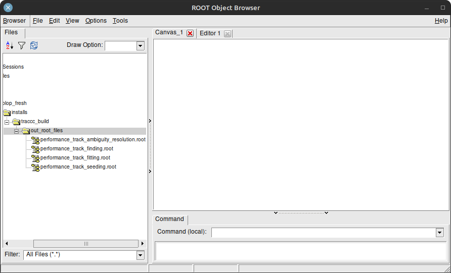
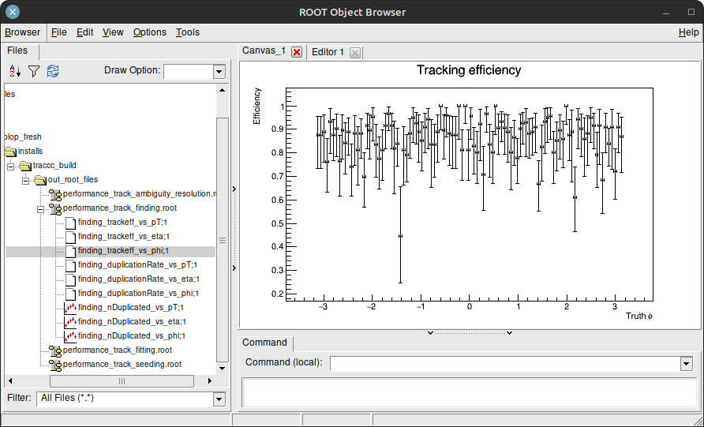
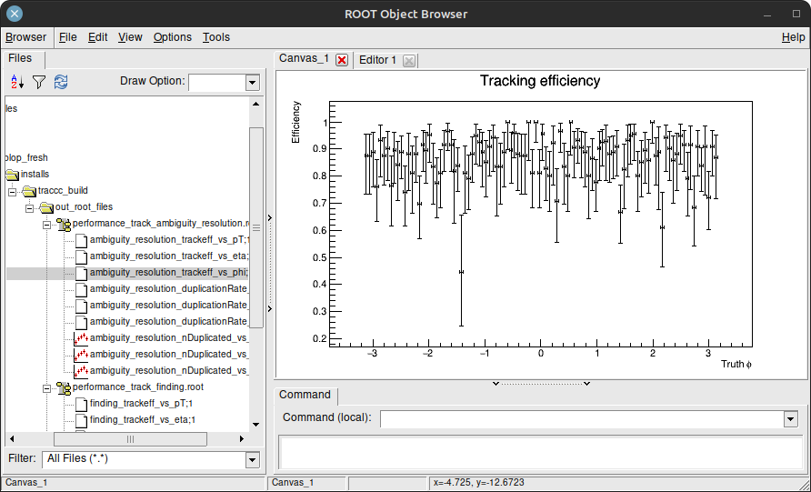

# Specific documentation on how to build and use ROOT for traccc

Last update: April 10, 2024.

## Introduction

`traccc` generates data than can be visualized by `ROOT`, in order to evaluate the performance of some algorithms. Let's recap the full compilation and execution of `traccc`, since the initial clone, starting with the installation of ROOT.

To use `ROOT` in `traccc`, you need a working installation of `ROOT` compiled with the `C++17` standard. The [last precompiled version of root](https://root.cern/install/) may not be compiled with the `C++17` standard, so it may be necessary to [build ROOT from source as described on the official website](https://root.cern/install/build_from_source/).

<br>

## ROOT installation / compilation

This documentation was not written by `ROOT` members, and is intended for information purposes only. This installation of `ROOT` proved to work on a freshly installed `Debian 12.5.0` computer equipped with a 4th generation Intel x86_64 CPU.

```bash
export root_source="<desired path to your root_src>" \
&& export root_build="<desired path to your root_build>" \
&& mkdir $root_build

# Clone the ROOT repository
git clone --branch latest-stable --depth=1 https://github.com/root-project/root.git $root_source

# Configure with cmake
cmake -S $root_source -B $root_build -DCMAKE_CXX_STANDARD=17 -DCXX_STANDARD_STRING="17" -DCMAKE_CXX_COMPILER=clang++-16 -DCMAKE_C_COMPILER=clang-16 
# Should you be on a server without X11, you may want to add the "-Dx11=OFF" flag.

# Build ROOT
cd root_build/ && make -j `nproc`
```

<br>

## traccc compilation

```sh
# Prerequisites: boost and curl
sudo apt install -y libboost-all-dev curl

# First, clone the traccc repository and download necessary data files
# clone over ssh: git clone git@github.com:acts-project/traccc.git
git clone https://github.com/acts-project/traccc.git \
&& cd traccc \
&& ./data/traccc_data_get_files.sh

# Shortcuts to your source and build folders
export traccc_build_folder="<desired path to your traccc_build>" \
&& export traccc_source_folder="<source path>"

# Remove previous compilation files, if any
rm -rf $traccc_build_folder && mkdir $traccc_build_folder

# Source the ROOT script
source "<path to root_build>/bin/thisroot.sh"

# Build traccc on CPU
cmake -S $traccc_source_folder -B $traccc_build_folder -DCMAKE_CXX_COMPILER=clang++-16 -DCMAKE_C_COMPILER=clang-16 \
&& cd $traccc_build_folder \
&& make -j `nproc`
```

<br>

## Geometry data generation, with the toy detector 

```sh
export traccc_data_directory="${traccc_source_folder}/data" \
&& export traccc_geometry_folder_name="generated_toy_geometry" \
&& export traccc_geometry_directory="${traccc_data_directory}/${traccc_geometry_folder_name}"

# Remove previous generated files, if any
rm -fr $traccc_geometry_directory \
&& mkdir $traccc_geometry_directory \
&& cd $traccc_geometry_directory

# Generate muon-like particle data with the pre-built detray geometry (toy geometry data):
${traccc_build_folder}/bin/traccc_simulate_toy_detector --gen-vertex-xyz-mm=0:0:0 --gen-vertex-xyz-std-mm=0:0:0 --gen-mom-gev=100:100 --gen-phi-degree=0:360 --events=10 --gen-nparticles=2000 --output-directory=detray_simulation/toy_detector/n_particles_2000/ --gen-eta=-3:3 --constraint-step-size-mm=1
```

<br>

## Generation of the ROOT performance files, by executing the traccc full-chain `traccc_seeding_example`

```sh
export traccc_out_root_files_directory="${traccc_build_folder}/out_root_files"

rm -fr $traccc_out_root_files_directory \
&& mkdir $traccc_out_root_files_directory \
&& cd $traccc_out_root_files_directory

${traccc_build_folder}/bin/traccc_seeding_example --input-directory=detray_simulation/toy_detector/n_particles_2000/ --check-performance --detector-file=$traccc_geometry_folder_name/toy_detector_geometry.json --material-file=$traccc_geometry_folder_name/toy_detector_homogeneous_material.json --grid-file=$traccc_geometry_folder_name/toy_detector_surface_grids.json --event=1 --track-candidates-range=3:30 --constraint-step-size-mm=1000
```

<br>

## ROOT performance files visualization

You can either browse a directory containing the `ROOT` files and display each plot, or display a plot in particular.

Your `root` executable may be called `root.exe`. If so, use `root.exe` instead of `root`.

`end of file` terminates the `ROOT` prompt, so you may use `Ctrl + D` as a shortcut to exit `ROOT`. 

```sh
cd $traccc_out_root_files_directory

# Start the root command-line interface
root

# If you prefer not to use your web browser, you can disable its usage with the "--web" flag:
root --web=off

# You should see the prompt "root [0]".
# To browse a directory containing ROOT files, create a TBrowser:
root [0] new TBrowser
```

The native `TBwoser` should look like this. You can open `.root` files and display the graphics they contain.



<br>

## ROOT performance files interpretation

The `Number of duplicated track candidates` plots represents the number of `track duplicates` as a function of a given variable (example: `phi`). It varies between zero (no shared hits between tracks) and the number of `duplicated tracks` for a given value (example: of `phi`).


There are often many duplicated tracks at the end of the finding algorithm. The last algorithm in the chain is an ambiguity solver which attempts to decrease the number of duplicates while keeping as much valid tracks as possible. Here the `greedy solver` removed all the duplicates. It is an implementation of the greedy ambiguity resolution algorithm from ACTS adapted to `traccc`.


The `Tracking Efficiency` plots represents the number of `tracks matching the trajectory of a truth particle`, as a function of a given variable. It ranges from zero (no valid track found for a given value) to one (all the tracks were found for a given value).



The `greedy solver` performed very well in this case, since the truth particles were generated as high energy muons, mostly going through a straight line. We used `--gen-mom-gev=100:100` when running the traccc_simulate_toy_detector, generating high energy muons (100 GeV).



<br>

## Alternative visualization

You can display plots directly without creating a `TBrowser` by loading a file with `ROOT` and calling the `Draw()` method on the plot you whish to display. Here is an example displaying the previous plots:

```c++
// In a new ROOT prompt, load the .root file
root -l performance_track_finding.root

// Track finding efficiency
finding_trackeff_vs_phi->Draw()

// Track finding duplication rate
finding_nDuplicated_vs_phi->Draw()

// In a new ROOT prompt, load the .root file
root -l performance_track_ambiguity_resolution.root

// Ambiguity resolution efficiency
ambiguity_resolution_trackeff_vs_phi->Draw()

// Ambiguity resolution duplication rate
ambiguity_resolution_nDuplicated_vs_phi->Draw()
```
